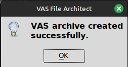

# VAS-File-Architect
## Table of Contents
1. [Overview](#overview)
2. [Benefits](#benefits)
3. [Installation](#installation)
4. [Setup](#setup)
5. [Usage](#usage)
6. [Modules](#modules)
7. [FAQ or Troubleshooting](#faq-or-troubleshooting)
8. [Contributing](#contributing)
9. [License](#license)

---

## Overview
[VAS File Architect](https://github.com/phrayse/VAS-File-Architect) is a comprehensive tool designed to streamline the creation of Video Auto Split (`.vas`) archives for use with [ROMaster2's VideoAutoSplit component](https://github.com/ROMaster2/LiveSplit.VideoAutoSplit).  
This program automates the process of generating a game profile (`structure.xml`), a template Auto Split Language (ASL) script (`script.asl`), and the final `.vas` archive containing all necessary files.

The primary focus of __VAS File Architect__ is to ensure that I never have to create another `structure.xml` file by hand again - and maybe help others avoid it too.


---

## Benefits
### Easy Game Profile Creation:
The most significant advantage of using __VAS File Architect__ is its ability to automate the creation of complex game profiles, which are essential for use with the __Video Auto Split__ component.

### Automated Processing:
Once the target directory is selected, the program automatically:
- Groups images based on bounding box coordinates and their containing directory.
- Generates a `structure.xml` file, creating unique WatchZones for each group of images.
- Creates a `script.asl` template populated with a list of recognised image masks.
- Compiles the processed images, `script.asl`, and `structure.xml` into a `.vas` archive.

### User-friendly
Once the user selects their target directory, VASFA will handle the rest!<sup>*</sup>  


<sub>*except getting the screenshots or making the unnecessary parts of the screenshots transparent or writing the code for the actions in the script file or installing the LiveSplit component or getting the component to recognise your capture card or</sub>

---

## Installation
### Cloning the Repository
To clone the repository use the following command:

```bash
git clone https://github.com/phrayse/VAS-File-Architect.git
```
### Download Executable
Alternatively, you can download the executable directly from the [Releases page](https://github.com/phrayse/VAS-File-Architect/releases).

---

## Setup
1. Create a directory with the same name as your game.
2. Get a screenshot of each frame you wish to use in your splitter.
3. Use an image editing program such as [GIMP](https://www.gimp.org) to transform each image as follows:
    - Maintain the original dimensions of the image (don't crop).
    - Excluding the area you wish to track, make everything transparent.
    - Export this mostly-transparent image as a `.png` file into your game directory.
4. (optional) Organise your mask images into subdirectories within the game directory.


---

## Usage
1. Run program, choose target directory.  
2. Open the resulting `.vas` archive, found inside your target directory.
3. Open the `script.asl` template and insert your code.

  

### Notes
- Logging is active and can be found in `vasfa.log`.
- Refer to the [Video Auto Splitter instructions](https://github.com/ROMaster2/LiveSplit.VideoAutoSplit?tab=readme-ov-file#how-to-use) for help installing the LiveSplit component.

---

## Modules
- `main.py`: Coordinates the overall workflow.  
- `image_processing.py`: Handles image cropping and grouping.  
- `xml_generation.py`: Generates game profile.  
- `asl_generation.py`: Creates an Auto Splitting Language script template.  
- `vas_archive_generation.py`: Compiles assets into a `.vas` archive.

---

## FAQ or Troubleshooting
Check `vasfa.log` for detailed info and error messages.  
Additionally, you can test VASFA out on the demo folder included in the main repository.

*Q: How do I modify the ASL script?*  
A: Open the `script.asl` file from the `.vas` archive and customize the action blocks as per your specific requirements.

*Q: How do I change the Error Metrics used for image comparisons?*  
A: Open the `structure.xml` file from the `.vas` archive and uncomment the ErrorMetric tag in the relevant WatchZone.
Options are listed atop the document in a comment node.

*Q: Why are some of my images being renamed?*  
A: Image masks must have unique names throughout the directory so the `script.asl` file can differentiate between them.
The original files will remain untouched, only the archived version is amended.

---

## Contributing
Contributions to the project are welcome. Feel free to submit a pull request or message me directly with feedback.

---

## License
__VAS File Architect__ is released under the MIT License. For more details, see the LICENSE file in the repository.
